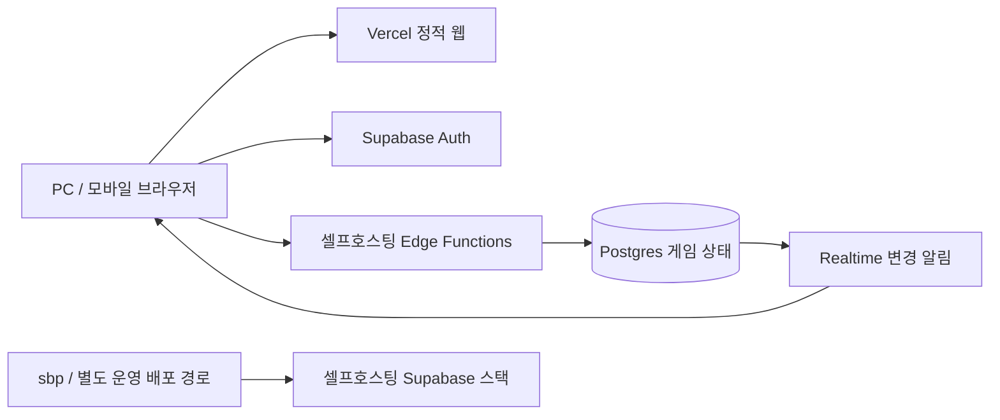

# 스페이스 크루 웹 — 구현 계획 초안

작성일: 2026-09-09. 상태: 프론트·로컬 미션 1~4·연동 계약 구현, 원격 백엔드 미구현. 근거와 확인 한계는 [RESEARCH.ko.md](./RESEARCH.ko.md)를 따른다. 아래는 전체 목표를 담은 계획이며, 실제 구현 범위와 남은 작업은 [프론트 인계 문서](./FRONTEND-HANDOFF.ko.md)를 따른다.

## 1. 목표와 범위

친구가 초대 링크를 열고 닉네임을 입력하면 같은 방에서 한국어로 스페이스 크루를 플레이한다. PC와 모바일이 함께 접속하고, 브라우저 종료·통신 단절 후에는 저장된 시점으로 복귀한다.

| 구분 | 범위 |
| --- | --- |
| 첫 플레이 가능 버전 | 3~5인, 초기 미션, 한국어 PC/모바일, 초대, 자동 저장, 같은 브라우저 복귀 |
| 완성 목표 v1 | 기본 50개 미션, 시작 번호 지정·랜덤 모드, 특수 조건, 캠페인 기록, 기기 변경용 자리 복구, 운영 검증 |
| 후속 확장 | 2인 JARVIS, 추가 도전 변형, PWA 설치, 소셜 로그인, 연습 모드 |
| 초기 범위 밖 | 공개 매칭·랭킹·음성 채팅·관전자·자동 대리 플레이 |

원작 2인 모드는 배분·공개 정보·대리 조작 방식이 달라 별도 단계로 둔다. 3~5인만 지원하는 초기 버전을 ‘원작 모든 인원 지원’으로 표기하지 않는다. 50개 미션은 최종 목표에 유지한다.

## 2. 권장 아키텍처



- 웹: React + TypeScript + Vite. 반응형 CSS와 한국어 UI. SSR이 필요한 서비스가 아니므로 정적 SPA로 시작한다.
- 게임 엔진: 입출력이 명확한 TypeScript 순수 함수. 같은 명령·상태·서버 난수 입력으로 같은 결과를 만든다.
- 서버: Supabase Edge Functions가 인증·권한·게임 판정·트랜잭션을 담당한다. 프로세스 메모리에 방을 보관하지 않는다.
- 저장: Postgres를 최종 상태의 기준으로 삼는다. 서버 재시작에도 동일한 게임을 복원한다.
- 실시간: Realtime은 변경 사실과 접속 표시를 전달하고 실제 상태는 권한이 적용된 API에서 읽는다.
- 관리: sbp는 프로젝트 운영 도구다. 플레이어 웹에서 관리 API를 호출하지 않는다.

프런트엔드 공개 환경 변수는 실제 프로젝트 API URL과 공개 클라이언트 키만 담는다. DB 비밀번호·기계 토큰·서버 키는 셀프호스팅 서버 측 비밀 저장소에서 관리한다. 사용하는 패키지 버전과 lockfile은 구현 시 고정한다.

## 3. 첫 단계: 플랫폼 가능 여부 검증

아래 결과가 확보되어야 실제 멀티플레이 배포에 들어간다. 로컬 화면·엔진 개발은 이 검증과 독립적으로 시작할 수 있다.

| 항목 | 필요한 결과 |
| --- | --- |
| 프로젝트 접근 | UUID, 전용 credential 파일 경로, 현재 scope/만료와 runtime 정책 확인 |
| 앱 연결 | 실제 API URL·공개 키, PC/모바일에서 HTTPS 접근 |
| 게스트 Auth | 익명 로그인 설정 적용, 신규·갱신 세션 정상 동작 |
| 서버 배포 | 게임 Edge Function과 비밀 설정 배포/롤백 경로 확보 |
| DB 변경 | private schema·역할·정책·트리거를 포함한 버전 관리 migration 적용 경로 |
| 실시간 | 외부 WebSocket, 인증 채널, 다른 방 접근 거부 |
| 트랜잭션 | Edge → 내부 DB 연결에서 잠금·commit·rollback 검증 |
| Vercel 연동 | CORS, `/join`과 `/rooms/:id` 직접 접속 및 새로고침 |

현재 sbp SQL/Functions/설정 제한 때문에 이 단계는 필수다. **테이블 CRUD가 된다는 사실만으로 게임 서버가 준비됐다고 판정하지 않는다.** 현재 준비되지 않은 인프라를 프런트엔드 판정으로 대체하지 않는다.

개발용 환경과 운영용 환경을 분리한다. 플랫폼 자원 상황이 확인되기 전까지 원격 스택을 여러 개 만들 계획을 전제로 삼지 않는다. 로컬 Supabase 개발환경과 프로젝트 전용 검증 환경을 우선 검토한다.

## 4. 플레이어 흐름

1. 방장이 닉네임, 인원, 미션 선택 방식을 정하고 방을 만든다. 미션은 번호 지정 또는 랜덤으로 선택한다.
2. 초대 링크를 공유한다. `/join#<초대토큰>` 형태를 우선 검토하고 토큰은 서버 요청 본문으로 전달한다.
3. 참여자는 익명 세션을 얻고 닉네임을 입력한다. 기존 멤버는 원래 자리로, 신규 멤버는 빈 자리로 들어간다.
4. 모두 준비하면 서버가 좌석 순서와 실제 미션을 확정한다. 미션 브리핑을 확인하고 전원이 준비하면 카드를 배분한다.
5. 임무 선택·특수 준비·통신·카드 플레이를 진행한다. 매 행동이 서버에 저장된다.
6. 성공/실패 후 결과를 확인하고 재도전·다음 미션·나중에 이어하기를 선택한다.
7. 재접속하면 현재 방·자리·미션·손패·미완료 선택을 읽어 계속한다.

초대 토큰은 충분한 서버 난수로 발급하고 해시로 저장한다. 만료·회전·입장 잠금을 지원한다. URL fragment를 사용해도 앱 분석 로그에 토큰을 남기지 않으며, 입장 완료 후 주소에서 제거한다. 만료된 초대는 신규 입장만 막고 기존 멤버의 `/rooms/:id` 복귀 권한과 구분한다.

### 시작 미션 지정·랜덤 모드 — 사용자 요청 반영

| 방 만들기 설정 | 동작 |
| --- | --- |
| 번호 지정 | 1~50 중 시작 미션 선택. 기본 1번. 이전 미션 완료 없이 선택 가능 |
| 랜덤 | 현재 인원·규칙에서 지원되는 1~50 중 서버가 균등하게 선택 |

번호 지정 시 미션 번호와 직접 작성한 조건 요약을 보여준다. 예를 들어 23번으로 시작하면 다음 성공 후 24번으로 진행한다. 건너뛴 1~22번을 성공으로 기록하지 않는다. 50번 성공 시 해당 진행을 종료하고 새 진행을 선택할 수 있다.

랜덤은 **매 성공 후 다음 미션도 랜덤으로 진행**하는 기본안이다. 이번 랜덤 진행에서 이미 뽑힌 미션은 제외하고, 후보가 모두 소진되면 완료 화면을 보여준다. 사용자가 ‘새 랜덤 진행’을 선택해야 후보를 초기화한다. 아직 구현되지 않았거나 판정 검증이 끝나지 않은 미션을 플레이 가능 목록에 넣지 않는다. 개발 중 부분 지원은 `플레이 가능 3/50`처럼 표시하고, 완성 버전의 범위는 50개를 유지한다.

실패하면 같은 미션을 재도전한다. 손패와 목표 카드는 원래 재시도 규칙대로 새로 배분하지만 미션 번호는 다시 추첨하지 않는다. 구조 신호 기록 등 해당 미션의 지속 정보도 유지한다. 재접속·새로고침·시작 버튼 중복 요청 역시 재추첨을 일으키지 않는다.

방 생성 시 선택 방식·시작 번호를 저장하고, **게임 시작 트랜잭션에서 실제 미션을 한 번 확정해 MISSION_BRIEFING으로 전환**한다. 손패 배분은 브리핑 전원 준비 후 별도 명령으로 진행한다. 랜덤일 때 로비에는 ‘시작 시 무작위 선택’으로 표시한다. 방장은 시작 전 설정을 바꿀 수 있지만 변경 시 전원의 준비를 해제하고 다시 준비하도록 한다. 진행 중 설정 변경은 막는다.

미션 사이에는 다음 미션 브리핑을 표시하고 전원 준비 후 배분한다. 랜덤 추첨 결과를 보고 자동으로 여러 번 다시 뽑는 버튼은 두지 않는다. 새로운 선택 방식으로 바꾸려면 기존 진행을 종료하고 새 진행을 만든다.

저장 필드 초안: `mission_selection_mode`, `requested_start_mission_id`, `current_mission_id`, `selection_cycle_id`, `drawn_mission_ids`, `mission_run_id`, `attempt_id`, `ruleset_version`, `eligible_catalog_version`. 랜덤 후보 선택은 편향 없는 서버 난수로 수행하며 실제 뽑힌 ID를 저장한다. 추첨 결과와 다음 run 생성은 같은 잠금·트랜잭션·command ID로 중복을 방지한다.

인원과 규칙에 따라 후보 집합을 고정한다. 완료되어 배분이 시작된 run의 규칙은 설정 수정이나 카탈로그 배포로 바꾸지 않는다. 이후 지원 미션이 추가되어도 진행 중 랜덤 후보를 조용히 늘리지 않고 새 진행부터 반영한다.

## 5. 재접속·자리 복구 정책

| 상황 | 제안 동작 |
| --- | --- |
| 새로고침·잠깐 네트워크 끊김 | 세션 갱신 후 같은 자리의 최신 상태 복원 |
| 모바일 백그라운드 복귀 | WebSocket 재연결, 최신 상태 재조회, 확인 후 조작 허용 |
| 브라우저 종료 후 재방문 | 남아 있는 Auth 세션으로 복원 |
| 다른 기기·브라우저 데이터 삭제 | 개인 자리 복구 코드 또는 추후 연결 계정으로 복원 |
| 같은 자리에서 탭 여러 개 | 읽기는 가능, 행동은 revision과 중복 방지로 한 번만 처리 |
| 차례인 사람이 오프라인 | 해당 차례를 유지하고 복귀 대기. 자동 카드 제출 없음 |
| 방장이 오프라인 | 게임은 서버에서 유지. 방 관리 권한과 게임 지휘관을 분리 |
| 새 사람이 진행 중 링크 방문 | 기존 손패에 접근하지 못함. 진행 중 새 좌석 합류는 제한 |
| 전원이 나감 | 저장 상태 유지. TTL은 별도 운영 정책으로 확정 |

**방 초대 링크는 개인 자리의 복구 비밀번호가 아니다.** 같은 닉네임을 입력했다는 이유로 자리를 돌려주지 않는다.

v1의 기기 변경 복구는 개인별 고엔트로피 비밀 코드를 저장하도록 제안한다. 서버에는 해시만 보관한다. 사용 시 새 Auth 사용자와 안정적인 player ID를 원자적으로 연결하고 코드를 교체하며, 이전 인증 연결의 자리 권한을 무효화한다. 사용 횟수·입력 속도를 제한하고 방 코드와 구분한다. 기존 화면에서 이미 보았던 손패까지 회수할 수 있다는 보장은 하지 않는다.

익명 사용자 자동 정리와 방 데이터 삭제는 분리한다. 활성 게임 참가자를 정리 대상으로 삼지 않는다. 진행 중 멤버 교체는 미션 재시작 정책과 함께 후속 확정하고, 초기에는 연결 단절을 이유로 좌석을 비우지 않는다. [익명 Auth의 복구 한계](https://supabase.com/docs/guides/auth/auth-anonymous).

## 6. 서버 판정과 동시성

명령 예: `choose_task`, `request_communication`, `communicate`, `play_card`, `vote_distress`, `select_pass_card`, `ready_next_mission`.

명령에는 `room_id`, `attempt_id`, `command_id`, `expected_revision`, 명령별 입력을 담는다. 실행 주체는 검증한 JWT와 현재 멤버십에서 얻고, 클라이언트가 보낸 플레이어 ID를 신뢰하지 않는다.

1. JWT를 서버에서 검증하고 멤버십·자리 사용 권한을 확인한다.
2. 단일 DB 트랜잭션에서 방 상태를 `SELECT ... FOR UPDATE`로 잠근다.
3. 같은 command ID가 이미 처리됐으면 같은 입력인지 확인해 기존 처리 결과를 돌려준다. 이 검사는 revision 충돌 판정보다 먼저 한다.
4. 시도 ID·revision·현재 단계·차례·소유 카드·허용 행동을 검증한다.
5. 엔진에서 다음 상태와 공개 가능한 결과를 계산한다.
6. 손패·판정·미션 기록·revision·중복 방지 기록·변경 알림용 행을 함께 저장하고 commit한다.
7. 호출자에게 결과를 반환한다. 알림을 받은 다른 클라이언트는 최신 상태를 조회한다.

클라이언트는 제출 대기 UI를 표시하되 서버 확정 전에 카드를 영구 제거하지 않는다. 실패한 명령은 한국어 오류와 최신 revision을 받는다. 응답 유실 시에는 **같은 command ID**로 재확인한다. HTTP 호출 전체의 exactly-once를 주장하지 않고, DB 내 명령 효과가 중복되지 않게 한다.

Edge Function에서 여러 PostgREST 요청을 순서대로 실행하는 것은 단일 트랜잭션이 아니다. 기본안은 내부 DB 연결과 전용 게임 역할을 사용하는 하나의 트랜잭션이다. 대안으로 원자적 RPC를 쓸 수 있지만, RPC 배포 권한과 서버 전용 실행 권한을 먼저 확보해야 한다. 클라이언트가 계산한 다음 상태를 권한 없이 저장하는 RPC는 허용하지 않는다. [PostgreSQL 행 잠금](https://www.postgresql.org/docs/current/explicit-locking.html).

## 7. 상태와 미션 엔진

대표 흐름은 다음과 같고, 미션별 준비 단계는 정해진 순서의 hook으로 구성한다.

```text
LOBBY → MISSION_BRIEFING → DEAL → MISSION_SETUP
MISSION_SETUP → PRE_TRICK → TRICK_PLAY → RESOLVE
RESOLVE → PRE_TRICK 또는 SUCCESS / FAILURE
SUCCESS / FAILURE → RESULT → 다음 진행의 MISSION_BRIEFING
```

`MISSION_SETUP`에는 임무 분배·지휘관 질문·구조 신호·양도 등 해당 미션에서 필요한 단계가 들어간다. 모든 미션에 같은 준비 순서를 강제하지 않는다. `PRE_TRICK`에서 통신 예약 목록을 고정하고 처리한 뒤 첫 카드를 받는다. 경계에서 늦게 도착한 예약은 다음 허용 단계로 넘기고 사용자에게 알린다.

조건 판정은 카드 제출 직후, 트릭 완성, 미션 종료를 구분한다. 같은 트릭에서 얻은 목표를 일괄 평가하고, 이미 실패가 확정되면 조기 종료하되 장기 조건이 남으면 계속한다. 초기 미션의 조기 성공 로직을 모든 특수 미션에 재사용하지 않는다.

미션 데이터 필드 초안:

- `id`, `ruleset_version`, `source_locator`, 직접 작성한 `summary_ko`
- `task_count`, `task_order_constraints`, `setup_steps`
- `communication_policy`, `player_count_overrides`
- `on_card_play`, `on_trick_end`, `on_attempt_end` 조건 목록
- 검증용 성공·실패·경계 fixture 참조

50개 미션의 기본 매개변수는 [미션별 대조표](./MISSIONS.ko.md)를 따른다. 자료 대조 완료와 판정 해결·엔진 테스트·다인 검증 상태를 분리하고, 플레이 가능 여부는 서버가 결정한다.

활성 게임은 ruleset/engine 버전을 고정한다. 배포 시 구버전 게임도 이어갈 수 있게 호환 처리하고, 알 수 없는 버전의 게임을 새 엔진으로 조용히 변경하지 않는다.

## 8. 데이터·권한 설계

| 개념 | 주요 저장 내용 | 공개 범위 |
| --- | --- | --- |
| players / identities | 안정적인 플레이어, 현재 Auth 연결·권한 세대 | 본인과 서버 |
| rooms / room_members | 방 설정, 미션 선택 방식·시작 번호, 좌석, 준비, 관리자 | 멤버에게 필요한 정보만 |
| room_invites / recovery_credentials | 토큰 해시·만료·사용 상태 | 서버 전용 |
| campaigns / mission_runs | 실제 미션 ID, 순차/랜덤 진행, 추첨 이력, 시도 수, 구조 신호 기록 | 방 멤버; 미래 랜덤 결과는 공개하지 않음 |
| game_states | 단계·차례·revision·engine 버전 | 서버 원본; API가 투영 |
| hands / setup_selections | 손패, 아직 공개하지 않은 선택 | 서버 및 본인 투영만 |
| tasks / communications | 현재 공개 가능한 임무·통신 | 공개 시점에 따라 투영 |
| command_receipts / game_events | 중복 처리 기록·서버 진단·재현 | 서버 전용 |
| room_versions | room ID, 최신 revision | 멤버에게 변경 알림용 |

게임 원본은 노출되지 않는 schema에 두고 웹에서 직접 읽기/쓰기를 막는다. 게임 서버 역할은 필요한 범위만 허용한다. 노출 테이블은 GRANT와 RLS를 함께 적용한다. `authenticated`라는 역할만으로 모든 방 접근을 허용하지 않는다. [Supabase RLS](https://supabase.com/docs/guides/database/postgres/row-level-security).

상태 API는 방의 공개 상태와 요청자 손패를 **같은 revision의 일관된 읽기**로 반환한다. 상대 손패·셔플 시드·숨겨진 임무·이전 전체 카드 기록은 내려보내지 않는다. 응답은 공유 캐시를 사용하지 않는다. 서버가 저장한 이벤트와 화면에 표시할 기록은 별개다.

## 9. 실시간 동기화

최초 구현은 `room_versions`의 변경을 Postgres Changes로 알리고 상태 API를 다시 읽는 방식을 우선 검증한다. publication과 멤버별 RLS가 필요하다. 상태 원본·손패 테이블을 무분별하게 publication에 넣지 않는다. [Postgres Changes](https://supabase.com/docs/guides/realtime/postgres-changes).

Presence는 접속 표시를 위한 보조 정보다. 게임 멤버십·턴·자리 소유의 근거로 사용하지 않는다. Presence/Broadcast private 채널은 별도로 멤버십 정책을 적용한다. [Realtime Authorization](https://supabase.com/docs/guides/realtime/authorization).

- 구독 완료와 초기 snapshot 사이의 변경을 revision으로 비교해 다시 읽는다.
- 이전 revision 알림은 무시하고, 누락된 알림은 재접속·포커스 복귀·저빈도 재검증으로 회복한다.
- 중복/역순 알림이 와도 화면은 최신 revision을 유지한다.
- Realtime 장애 시 제한적 폴링과 연결 상태 안내로 동작을 유지한다.
- commit 직후 함수가 종료돼도 저장된 `room_versions`가 남는다. 알림 발송 성공만을 상태 저장의 근거로 삼지 않는다.
- 복구·권한 회수 후 오래 열린 채널에 대해 재인증/재구독을 시험한다. 민감한 상태를 Broadcast payload로 보내지 않는다.

## 10. PC·모바일 화면

| 화면 | PC | 모바일 |
| --- | --- | --- |
| 로비 | 방 설정·시작 미션/랜덤·조건 미리보기·좌석·초대·준비 상태 | 한 열 구성, 번호 선택/랜덤 버튼, 초대 공유 버튼 |
| 게임 | 중앙 트릭, 주변 대원, 하단 손패, 측면 미션 | 상단 차례/연결, 중앙 트릭, 하단 고정 손패, 미션 접이식 패널 |
| 카드 선택 | 클릭/키보드로 선택 후 제출 | 탭으로 확대 선택 후 별도 제출 |
| 통신 | 공개할 카드·표시 선택 | 큰 버튼으로 최고/최저/유일 선택 |
| 복귀 | 최신 상태와 대기 중 행동 표시 | 백그라운드 복귀 시 재동기화 표시 |

색과 별도 문양·텍스트를 함께 사용한다. 360px부터 가로 스크롤 없이 핵심 조작을 제공하고 44px 이상 터치 영역을 목표로 한다. 3인 손패 14장이 모바일에서 선택 가능해야 한다. 호버를 필수로 하지 않으며, iOS 안전 영역과 가상 키보드를 고려한다.

메뉴·규칙·오류·연결 안내·미션 조건은 한국어로 제공한다. 자유 채팅은 초기 게임 화면에 넣지 않고 준비/대기 등 운영 메시지와 규칙상 허용된 선택을 제공한다. 외부 음성 대화 준수는 기술적으로 강제할 수 없으므로 통신 규칙을 안내한다.

## 11. 단계별 개발과 완료 기준

| 단계 | 결과물 | 통과 기준 |
| --- | --- | --- |
| 0. 플랫폼 검증 | 프로젝트 연결, 배포·인증·DB·Realtime 경로 기록 | 2개 독립 세션이 서버에 저장된 상태를 읽고 권한 분리 통과 |
| 1. 규칙 명세·엔진 | 카드/트릭/통신/임무 엔진, 초반 미션 fixture | 합법 수·오수령·동시 목표·시도 초기화 판정 테스트 통과 |
| 2. 작은 실제 게임 | 초대 로비, 3~5인, 초기 1~3번의 번호/랜덤 선택, 서버 저장 | 독립 브라우저들이 한 미션을 끝내고 중간 새로고침 복귀; 부분 지원 표시 |
| 3. 초반 캠페인 | 1~10번, 구조 신호, 지휘관 질문, 통신 제약 | 각 미션 정상/실패 fixture와 3/4/5인 플레이 통과 |
| 4. 50개 완성 | 후반 특수 조건, 1~50 직접 시작/랜덤, 캠페인 기록, 5인 예외 | 50개 원본 대조표·조건별 테스트, 미검증 미션 없음 |
| 5. 복구·모바일·운영 | 개인 자리 복구, 기기 혼합, 배포/복구 절차 | 아래 수용 시나리오 및 실제 모바일 검증 통과 |

첫 실행 순서는 **플랫폼 검증 → 서버 저장되는 한 미션 → 복귀 검증 → 전체 미션 확장**이다. 같은 브라우저 복귀와 모바일 기본 구조는 단계 2부터 포함하고 마지막에 붙이지 않는다. 단계 0 결과 후 실제 배포 제약을 반영해 일정·작업량을 산정한다.

## 12. 핵심 수용 시나리오

1. PC 2명·모바일 2명이 초대 링크만으로 닉네임을 정하고 같은 방에서 시작한다.
2. 별도 계정 5개가 연결되어도 각 응답에는 자기 손패만 존재한다.
3. 같은 카드 제출을 연속 클릭하거나 네트워크 재전송해도 상태가 한 번만 바뀐다.
4. 오래된 탭·이전 시도의 요청·남의 카드 제출·차례 밖 요청은 서버에서 거절한다.
5. commit 후 응답이 유실되어도 재시도로 이미 낸 카드가 중복 처리되지 않는다.
6. 임무 선택 중, 통신 예약 중, 카드 교환 선택 중, 트릭 중간에 나갔다 돌아와도 이어진다.
7. 서버 함수/Realtime 재시작 뒤 snapshot으로 복구하고 접속자 상태만 다시 구성한다.
8. 방장 이탈이 게임 삭제나 지휘관 변경을 일으키지 않는다.
9. 초대 링크·같은 닉네임만으로 기존 좌석을 탈취할 수 없다.
10. 복구 코드 사용 후 새 기기가 자리를 이어받고 기존 인증 연결은 추가 행동에 실패한다.
11. 3인 잔여 한 장·복수 목표의 같은 트릭 판정·미션 종료 경계가 정확하다.
12. 모바일 Safari/Chrome에서 앱 전환·화면 잠금 후 복귀, 손패 선택, 직접 방 URL 접속이 동작한다.
13. 다른 방 사용자는 REST·상태 API·Realtime 경로 모두에서 정보를 얻지 못한다.
14. 미션 진행 도중 프런트엔드가 갱신되어도 엔진 버전 불일치를 감지하고 이어가기 정책이 동작한다.
15. 방 생성 시 23번을 선택하면 23번 조건으로 시작하고, 성공 후 24번으로 간다. 1~22번 기록은 생성하지 않는다.
16. 랜덤 시작 버튼의 중복 요청·응답 유실·새로고침에도 모든 참여자가 동일한 미션 ID를 받는다.
17. 랜덤 실패 후 재도전은 같은 미션, 성공 후 다음 진행은 미추첨 미션이다. 후보 소진 시 완료 처리한다.
18. 번호 0/51/소수·미지원 ID·조작된 랜덤 결과를 서버에서 거부한다. 지원 번호 끝의 다음 번호를 임의로 생성하지 않는다.
19. 시작 직전 방 설정 변경과 게임 시작이 경합해도 하나의 revision만 확정되며 변경된 조건에 전원이 다시 준비한다.
20. 5인으로 후반 미션을 바로 선택하거나 무작위로 뽑아도 해당 미션의 인원별 규칙이 적용된다.

검증 도구 후보는 엔진 단위/속성 테스트, DB 권한·트랜잭션 통합 테스트, Playwright 다중 browser context, 실제 iOS/Android 기기다. 초기 부하 목표는 20개 방 × 5명 = 100접속으로 제안하되 서버 용량 보장은 아니다. 정상 회선에서 행동 반영 p95 1초 이내, 재연결 후 5초 이내 상태 복구를 측정 목표로 삼고 1/5/20개 방 순서로 검증한다.

## 13. 운영 준비와 다음 작업에 필요한 정보

실제 프로젝트 작업을 시작할 때 필요한 것은 새 프로젝트명 또는 UUID, 생성/프로젝트용 credential의 안전한 파일 경로, 앱 공개 연결 정보, 플랫폼 운영 배포 경로다. 토큰 값은 문서·채팅·Git에 기록하지 않는다. Functions·마이그레이션·익명 인증의 운영 지원 여부가 가장 먼저 해결할 항목이다.

플레이 데이터는 매 행동 저장하되 DB 디스크 손실은 별개의 복구 문제다. 현재 sbp cold backup은 게임 중단을 수반하므로 점검 시간과 분리하며, 운영 복원 절차·외부 백업·보관 기간은 실제 플랫폼 담당 경로에서 검증한다. 현재 `backups restore`를 운영 재해 복구로 설명하지 않는다.

다음 구현 작업의 첫 결과물은 최소 연결 시험과 1개 미션의 동작 시제품이다. 로컬 mock만 동작하는 상태, 실제 서버 저장 상태, 다인·재접속 검증 완료 상태를 구분해 보고한다.
